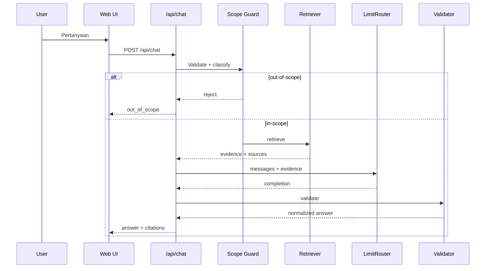

# Runtime Sequence

> **Project:** BPS AI Assistant — Web Demo  
> **Target:** Demo publik tanpa login  
> **Provider:** LimitRouter (`https://limitrouter.com/v1`)  
> **Rule:** API key server-side only.

