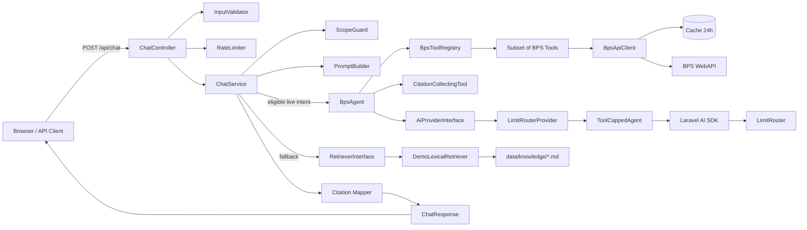
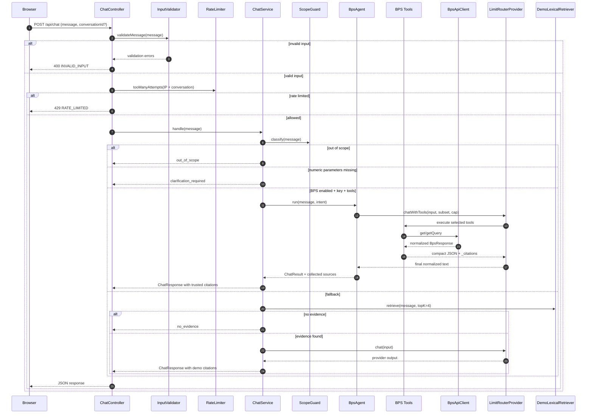
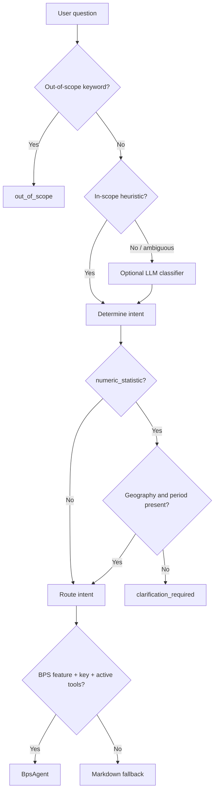
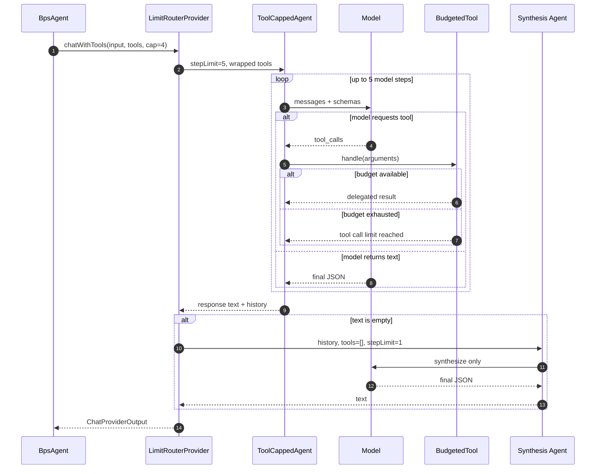
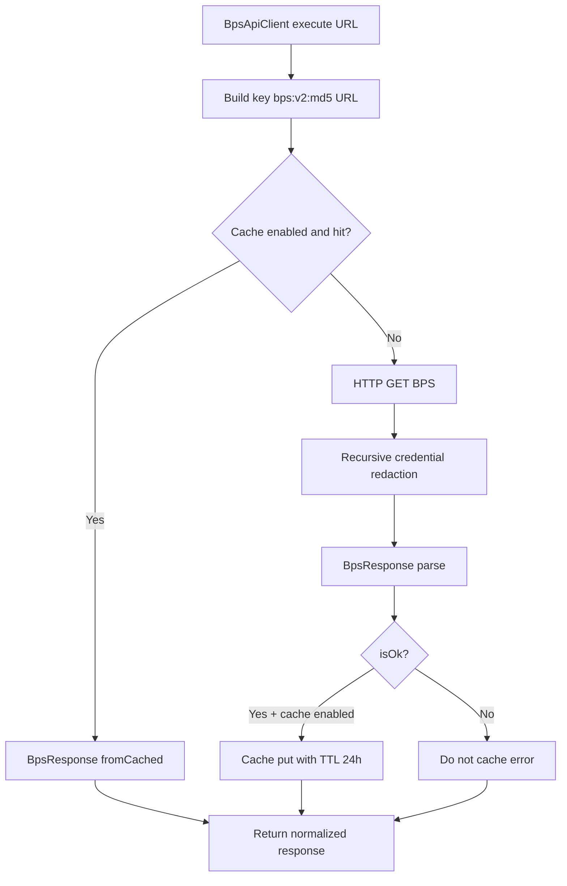
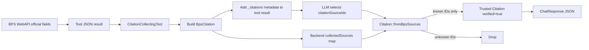
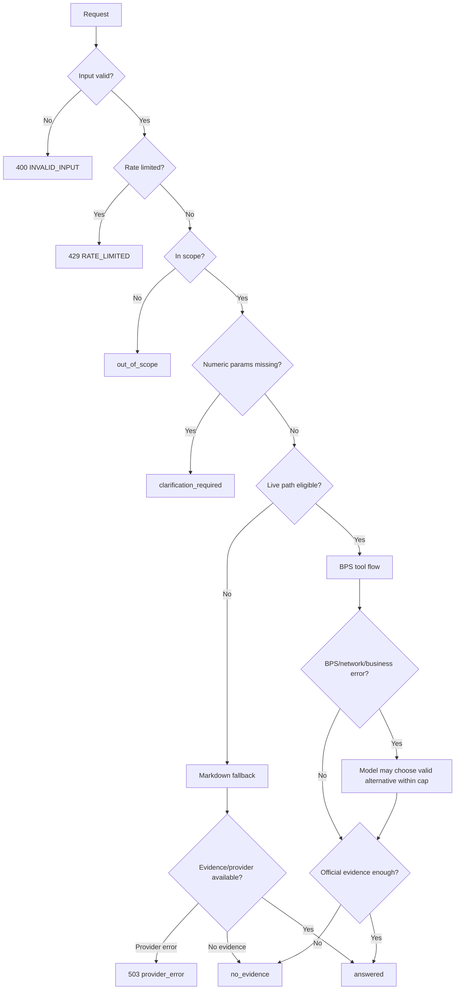

# Arsitektur dan Workflow Teknis BPS AI Assistant

> Referensi engineering untuk memahami request lifecycle, routing intent, tool-use agent, BPS WebAPI, cache, citation, error handling, keamanan, testing, dan operasional.

## Daftar Isi

- [1. System Context](#1-system-context)
- [2. Tujuan Arsitektur dan Constraints](#2-tujuan-arsitektur-dan-constraints)
- [3. Arsitektur Komponen](#3-arsitektur-komponen)
- [4. Tanggung Jawab Komponen](#4-tanggung-jawab-komponen)
- [5. Request Lifecycle `/api/chat`](#5-request-lifecycle-apichat)
- [6. Scope Classification dan Intent Routing](#6-scope-classification-dan-intent-routing)
- [7. Feature Flag dan Fallback](#7-feature-flag-dan-fallback)
- [8. BPS Tool Registry](#8-bps-tool-registry)
- [9. Katalog 25 BPS Tools](#9-katalog-25-bps-tools)
- [10. Native Laravel AI Tool Loop](#10-native-laravel-ai-tool-loop)
- [11. Execution Time Budget](#11-execution-time-budget)
- [12. BPS API Client dan Authentication](#12-bps-api-client-dan-authentication)
- [13. Response Normalization](#13-response-normalization)
- [14. Cache Lifecycle](#14-cache-lifecycle)
- [15. Credential Redaction](#15-credential-redaction)
- [16. Citation Trust Flow](#16-citation-trust-flow)
- [17. Error Handling dan Safe Fallback](#17-error-handling-dan-safe-fallback)
- [18. Windows/XAMPP TLS](#18-windowsxampp-tls)
- [19. Service Container Lifecycle](#19-service-container-lifecycle)
- [20. Internal API Contract](#20-internal-api-contract)
- [21. Environment Variables](#21-environment-variables)
- [22. Artisan Operations](#22-artisan-operations)
- [23. Testing Strategy](#23-testing-strategy)
- [24. Live Integration Scenarios](#24-live-integration-scenarios)
- [25. Security Boundaries](#25-security-boundaries)
- [26. Operational Runbook](#26-operational-runbook)
- [27. Troubleshooting Matrix](#27-troubleshooting-matrix)
- [28. Known Limitations](#28-known-limitations)
- [29. Extension Guide](#29-extension-guide)
- [30. File Map](#30-file-map)

---

## 1. System Context

BPS AI Assistant adalah aplikasi chat statistik yang berjalan pada server Laravel. Browser hanya berkomunikasi dengan API internal aplikasi. Seluruh koneksi ke LimitRouter dan BPS WebAPI dilakukan server-side.

Aplikasi memiliki dua jalur pengetahuan:

1. **jalur BPS WebAPI**, untuk intent yang memiliki tool live stabil;
2. **jalur knowledge base Markdown**, untuk fallback, definition, layanan BPS, atau kondisi saat live integration tidak digunakan.

Aplikasi tidak menganggap model sebagai sumber kebenaran. Model bertugas:

- memahami pertanyaan;
- memilih tool;
- menyusun parameter berdasarkan katalog;
- merangkum hasil tool;
- memilih citation source ID yang sudah disediakan backend.

Backend tetap menjadi authority untuk:

- URL endpoint;
- API key placement;
- timeout;
- cache;
- redaction;
- source ID;
- citation URL;
- verified state;
- response status yang dikirim ke browser.

---

## 2. Tujuan Arsitektur dan Constraints

### Tujuan

- Mengambil data dari sumber resmi BPS.
- Menjaga credential tetap server-side.
- Mencegah model mengarang angka dan citation.
- Membatasi latency, tool calls, result size, dan total execution time.
- Menjaga flow demo tetap tersedia sebagai rollback/fallback.
- Memisahkan provider, orchestration, tools, HTTP client, cache, dan presentation.
- Memudahkan penambahan tool atau intent tanpa mengubah controller/UI.

### Constraints

- BPS WebAPI dapat mengembalikan HTTP 200 dengan body error.
- Beberapa endpoint interoperabilitas memiliki nested error.
- Endpoint live dapat berubah atau tidak tersedia.
- LimitRouter dan BPS adalah layanan eksternal dengan latency/rate limit.
- Windows/XAMPP dapat tidak memiliki CA bundle sistem.
- Tool schema menambah model context.
- Model dapat meminta beberapa tools dalam satu step.
- Web SAPI memiliki `max_execution_time` yang dapat lebih pendek dari agent flow.
- Cache database membutuhkan database file dan migration table.

### Prinsip YAGNI

- Tidak ada repository layer tambahan untuk HTTP BPS; `BpsApiClient` sudah menjadi boundary tunggal.
- Tidak ada custom OpenAI protocol parser karena Laravel AI SDK sudah menangani loop/tool messages.
- Tidak ada distributed cache invalidation; demo memakai TTL dan explicit clear command.
- Tidak ada vector database baru; fallback lexical retriever dipertahankan.

---

## 3. Arsitektur Komponen



### Boundary utama

- **HTTP boundary:** `ChatController` dan `BpsApiClient`.
- **AI provider boundary:** `AiProviderInterface`.
- **Retrieval boundary:** `RetrieverInterface`.
- **Tool boundary:** `Laravel\Ai\Contracts\Tool`.
- **Citation trust boundary:** `Citation::fromSources()` dan `Citation::fromBpsSources()`.
- **Presentation boundary:** `ChatResponse::jsonSerialize()`.

---

## 4. Tanggung Jawab Komponen

| Path / Class | Tanggung Jawab | Input | Output | Dependency Utama |
|---|---|---|---|---|
| `app/Http/Controllers/ChatController.php` | Validate API input, rate limit, memanggil service, memetakan HTTP code | JSON `message`, optional `conversationId` | JSON response | `ChatService`, `InputValidator`, `RateLimiter` |
| `app/Ai/ChatService.php` | Orkestrasi scope, clarification, BPS branch, fallback, citation, response | user message | `ChatResponse` | provider, retriever, guard, prompt, optional `BpsAgent` |
| `app/Ai/ScopeGuard.php` | Heuristic dan optional LLM scope classification | question | `ScopeDecision` | Laravel AI agent untuk ambiguous input |
| `app/Ai/ScopeDecision.php` | DTO scope result | in-scope, intent, missing params | immutable decision | tidak ada |
| `app/Ai/PromptBuilder.php` | System prompt, tool rules, evidence block, message objects | question dan evidence | instructions + messages | `RetrievedSource`, Laravel AI messages |
| `app/Ai/AiProviderInterface.php` | Provider-independent chat contract | `ChatProviderInput` | `ChatProviderOutput` | Laravel AI `Tool` contract |
| `app/Ai/LimitRouterProvider.php` | Adapter Laravel AI/LimitRouter, model list, tool loop, synthesis | provider input dan tools | normalized output | Laravel AI SDK, `Http` |
| `app/Ai/ToolCappedAgent.php` | Menyediakan `maxSteps()` untuk anonymous agent | instructions, messages, tools, step limit | Laravel AI agent | `AnonymousAgent` |
| `app/Ai/BudgetedTool.php` | Hard cap jumlah eksekusi tool sequential/parallel | tool + shared consume closure | delegated tool result atau cap error | `ToolNameResolver` |
| `app/Ai/ChatResult.php` | Parse/normalize JSON model | raw model text | status, answer, clarification, IDs | JSON parser |
| `app/Ai/ChatResponse.php` | Serialize internal response ke client | request/result/citations | JSON-safe array | `Citation` |
| `app/Bps/BpsAgent.php` | Intent-specific tool orchestration, citation collection, execution budget | question + intent | `ChatResult` atau `null` | registry, prompt, provider |
| `app/Bps/BpsToolRegistry.php` | Intent → concrete tool classes | intent | `list<Tool>` | `BpsApiClient` |
| `app/Bps/CitationCollectingTool.php` | Membungkus tool, ekstrak official source metadata, tambah `_citations` | Laravel AI `Request` | JSON tool result | delegate tool |
| `app/Bps/BpsApiClient.php` | URL/auth/cache/redaction/HTTP boundary | path + params | `BpsResponse` | cache repository, Laravel `Http` |
| `app/Bps/BpsResponse.php` | Parse BPS outer envelope dan cache serialization | body + HTTP status | normalized DTO | JSON |
| `app/Bps/BpsApiException.php` | Safe network/transport exception | previous throwable | domain exception | `RuntimeException` |
| `app/Bps/BpsCitation.php` | Official BPS citation DTO | source metadata | immutable citation | tidak ada |
| `app/Bps/Tools/AbstractBpsTool.php` | Shared list/detail/error/output-bound behavior | endpoint params | compact JSON | `BpsApiClient` |
| `app/Bps/Tools/*Tool.php` | Endpoint-specific description, schema, params, result key | tool request | compact JSON | base/client |
| `app/Rag/RetrieverInterface.php` | Retrieval contract | question/topK | sources | implementation-specific |
| `app/Rag/DemoLexicalRetriever.php` | Lexical retrieval untuk `.md` fallback | question/topK | `RetrievedSource[]` | loaded docs |
| `app/Rag/KnowledgeLoader.php` | Muat Markdown knowledge base | directory | knowledge docs | filesystem |
| `app/Rag/Citation.php` | Trusted source-to-client citation mapping | backend sources + IDs | citations | BPS/demo DTO |
| `app/Providers/AiServiceProvider.php` | Register provider, guard, prompt, scoped chat service | container | bindings | Laravel container |
| `app/Providers/RagServiceProvider.php` | Register retriever, BPS client/registry/scoped agent | container | bindings | Laravel container |
| `app/Providers/AppServiceProvider.php` | Resolve CA bundle dan configure global HTTP verify | environment path | HTTP global options | Laravel application |
| `app/Console/Commands/BpsPreloadCommand.php` | Warm discovery cache | BPS client | exit code + console output | cache/BPS |
| `app/Console/Commands/BpsClearCacheCommand.php` | Flush dedicated cache store | none | exit code | Cache facade |

---

## 5. Request Lifecycle `/api/chat`



### HTTP code mapping

| Internal status | HTTP |
|---|---:|
| `answered` | 200 |
| `clarification_required` | 200 |
| `no_evidence` | 200 |
| `out_of_scope` | 200 |
| `rate_limited` | 429 |
| `provider_error` | 503 |

`no_evidence` adalah domain outcome aman, bukan transport error.

---

## 6. Scope Classification dan Intent Routing

### Heuristic layer

`ScopeGuard` menguji keyword out-of-scope lebih dulu, kemudian keyword BPS/statistik. Intent heuristic:

- definition;
- numeric statistic;
- publication;
- metadata/methodology;
- BPS service;
- navigation.

Jika pertanyaan ambiguous dan provider key tersedia, optional LLM classification digunakan. Jika classifier gagal, aplikasi memilih fallback in-scope aman (`definition`) alih-alih menolak secara agresif.

### Numeric clarification

Untuk `numeric_statistic`, `ScopeGuard` memeriksa:

- geography;
- period.

Jika kurang, `ChatService` berhenti sebelum retrieval/tool call dan menghasilkan pertanyaan klarifikasi.



### Intent behavior final

| Intent | Active path | Alasan |
|---|---|---|
| `definition` | `.md` fallback | live glosarium endpoint tidak stabil saat validasi |
| `numeric_statistic` | BPS tool path setelah clarification | membutuhkan official numbers/metadata |
| `publication` | BPS tool path | list/detail publication + official PDF URL |
| `metadata_methodology` | BPS tool path | static tables, units, variables |
| `navigation` | BPS tool path | domain/publication/press release/infographic |
| `bps_service` | `.md` fallback | informasi layanan berasal dari knowledge base |
| `out_of_scope` | immediate response | tidak memanggil retrieval/provider tools |

---

## 7. Feature Flag dan Fallback

`ChatService::shouldUseBpsAgent()` mensyaratkan:

```text
BpsAgent injected
AND config('bps.enabled') = true
AND config('bps.key') != ''
```

Walaupun syarat tersebut terpenuhi, `BpsAgent::run()` dapat mengembalikan `null` jika registry tidak memiliki tool untuk intent. `ChatService` lalu meneruskan request ke `.md` flow.

### Fallback cases

- `BPS_ENABLED=false`;
- `BPS_WEBAPI_KEY` kosong;
- intent registry kosong (`definition`, `bps_service`);
- retrieval fallback dipilih setelah agent `null`;
- BPS/tool/provider failure menghasilkan response aman sesuai layer, bukan raw exception.

Fallback menjaga demo usable tanpa menyamarkan citation trust:

- BPS citation → `verified:true`;
- Markdown demo citation → `verified:false`.

---

## 8. BPS Tool Registry

`BpsToolRegistry::forIntent()` membuat instance tool dengan shared `BpsApiClient`.

### Mapping final

| Intent | Tool subset |
|---|---|
| `definition` | tidak ada; fallback `.md` |
| `numeric_statistic` | domains, variables, periods, indicators, dynamic data, dataexim, SDGs, Sensus, SIMDASI |
| `publication` | publication list/detail, press release list/detail |
| `metadata_methodology` | static table list/detail, units, variables |
| `navigation` | domains, publications, press releases, infographics |
| `bps_service` | tidak ada; fallback `.md` |

Registry mengurangi schema context dan mencegah model melihat tool yang tidak relevan.

---

## 9. Katalog 25 BPS Tools

### 9.1 Core tools

| Class | Endpoint | Required | Optional | Result utama | Registry |
|---|---|---|---|---|---|
| `ListDomainsTool` | `/domain/model/domain` | `type` | `prov` | `domains` | numeric, navigation |
| `ListVarsTool` | `/list/model/var` | `domain` | `subject`, `lang`, `year`, `page` | `variables` | numeric, metadata |
| `GetGlosariumTool` | list/view `glosarium` | tidak ada untuk list; `id` untuk detail | `lang`, `prefix`, `page`, `perpage` | `terms` | tidak aktif saat endpoint live unavailable |
| `GetDynamicDataTool` | `/list/model/data` | `domain`, `var`, `th` | `vervar`, `turvar`, `turth` | `values` + official metadata | numeric |

`ListDomainsTool.type` enum:

```text
all | prov | kab | kabbyprov
```

### 9.2 Catalog tools

| Class | Endpoint | Required | Optional | Result key |
|---|---|---|---|---|
| `ListSubjectsTool` | `/list/model/subject` | `domain` | `lang` | `subjects` |
| `ListSubcatsTool` | `/list/model/subcat` | `domain` | `lang` | `subcategories` |
| `ListVervarsTool` | `/list/model/vervar` | `domain` | `lang` | `vertical_variables` |
| `ListPeriodsTool` | `/list/model/th` | `domain` | `var` | `periods` |
| `ListTurvarsTool` | `/list/model/turvar` | `domain` | `var` | `derived_variables` |
| `ListTurthsTool` | `/list/model/turth` | `domain` | `var` | `derived_periods` |
| `ListUnitsTool` | `/list/model/unit` | `domain` | — | `units` |
| `ListIndicatorsTool` | `/list/model/indicators` | `domain` | `var` | `indicators` |

### 9.3 Publication/content tools

| Class | Endpoint | Required | Optional | Result key |
|---|---|---|---|---|
| `ListPublicationsTool` | `/list/model/publication` | `domain` | `keyword`, `year`, `month`, `lang`, `page` | `publications` |
| `GetPublicationTool` | `/view/model/publication` | `domain`, `id` | `lang` | `publication` |
| `ListPressreleasesTool` | `/list/model/pressrelease` | `domain` | `keyword`, `year`, `month`, `lang`, `page` | `press_releases` |
| `GetPressreleaseTool` | `/view/model/pressrelease` | `domain`, `id` | `lang` | `press_release` |
| `ListStatictablesTool` | `/list/model/statictable` | `domain` | `keyword`, `year`, `lang`, `page` | `static_tables` |
| `GetStatictableTool` | `/view/model/statictable` | `domain`, `id` | `lang` | `static_table` |
| `ListInfographicsTool` | `/list/model/infographic` | `domain` | `keyword`, `lang`, `page` | `infographics` |
| `ListSdgsTool` | `/list/model/sdgs` | domain otomatis `0000` | `goal`, `lang`, `page` | `sdgs` |

Detail tools mempertahankan official row fields. Untuk publication, field penting:

- `pub_id`;
- `title`;
- `abstract`;
- `rl_date`;
- `pdf`.

### 9.4 Foreign trade

| Class | Endpoint | Required | Enum | Result key |
|---|---|---|---|---|
| `DataeximTool` | `/dataexim` via query auth | `sumber`, `periode`, `kodehs`, `jenishs`, `Tahun` | sumber `1/2`; periode `1/2`; jenishs `1/2` | `trade` |

Semicolon pada `kodehs=01;02` dipertahankan literal karena API menggunakan semicolon sebagai separator multiple HS codes.

### 9.5 Sensus

| Class | Endpoint | Required | Result key |
|---|---|---|---|
| `SensusListEventsTool` | `/interoperabilitas/datasource/sensus/id/37` | — | `events` |
| `SensusDataTool` | `/interoperabilitas/datasource/sensus/id/41` | `Kegiatan`, `Wilayah_sensus`, `Dataset` | `data` |

### 9.6 SIMDASI

| Class | Endpoint | Required | Result key |
|---|---|---|---|
| `SimdasiTablesTool` | `/interoperabilitas/datasource/simdasi/id/23` | `wilayah` | `tables` |
| `SimdasiDetailTool` | `/interoperabilitas/datasource/simdasi/id/25` | `wilayah`, `Tahun`, `id_tabel` | `data` |

SIMDASI dapat mengembalikan outer `status:OK` tetapi row:

```json
{
  "status": 400,
  "condition": "ERROR",
  "message": "Invalid Parameter"
}
```

`AbstractBpsTool` mengubah kondisi ini menjadi tool error.

---

## 10. Native Laravel AI Tool Loop

### Mengapa native SDK

Laravel AI SDK sudah menyediakan:

- provider/model resolution;
- schema mapping;
- tool call parsing;
- tool result execution;
- message history;
- multi-step loop;
- failover semantics;
- test fake gateway.

Raw `/chat/completions` implementation akan menduplikasi seluruh behavior tersebut.

### Hard cap dua lapis

1. `ToolCappedAgent::maxSteps()` membatasi model steps.
2. `BudgetedTool` memakai shared counter untuk membatasi actual tool executions.

Shared counter diperlukan karena satu model step dapat mengandung beberapa tool calls.

### Step formula

Provider membuat:

```text
stepLimit = maxToolCalls + 1
```

Extra step memberi kesempatan model menjawab setelah tool terakhir.

Jika seluruh steps masih berakhir pada tool calls dan final text kosong, provider membuat satu synthesis agent:

```text
tools = []
stepLimit = 1
messages = original input + tool-loop response messages
```

Synthesis agent tidak dapat memanggil tool tambahan, sehingga hard cap tetap utuh.



### Zero cap

Jika `maxToolCalls=0`:

- every wrapped tool rejects execution;
- delegate tool is never called;
- synthesis may still produce final `no_evidence`/clarification text;
- cap tetap terbukti melalui unit test.

---

## 11. Execution Time Budget

`timeoutSec` adalah timeout **per provider request**, bukan total agent run. Total bounded web execution ceiling:

```text
(maxToolCalls + 2) × timeoutSec + 5
```

Alasan `+2`:

1. native loop memiliki hingga `maxToolCalls + 1` steps;
2. optional no-tool synthesis call menambah satu provider request.

Contoh default:

```text
(4 + 2) × 60 + 5 = 365 seconds
```

`BpsAgent::run()` memanggil:

```php
@set_time_limit(BpsAgent::executionTimeLimit(...));
```

Ini bounded, bukan unlimited. Hosting/proxy/web server tetap dapat memiliki timeout eksternal yang lebih rendah dan perlu dikonfigurasi terpisah.

---

## 12. BPS API Client dan Authentication

### Path-segment auth

Sebagian besar endpoint:

```text
https://webapi.bps.go.id/v1/api/{path}/{param}/{value}/key/{key}
```

`BpsApiClient::get()`:

1. trim path;
2. split menjadi segments;
3. append nonempty params sebagai key/value path segments;
4. append `key/{key}`;
5. execute.

### Query auth

Dataexim:

```text
https://webapi.bps.go.id/v1/api/dataexim?sumber=1&...&key={key}
```

`BpsApiClient::getQuery()` menggunakan `http_build_query`, kemudian mengembalikan `%3B` menjadi `;` untuk multiple HS codes.

### Transport handling

- timeout dari `bps.http.timeout_sec`;
- `ConnectionException` dinormalisasi ke `BpsApiException`;
- raw transport message tidak dikirim ke model/client;
- key tidak dimasukkan ke error message aplikasi;
- body disensor sebelum parse/cache.

---

## 13. Response Normalization

`BpsResponse::parse()` memeriksa:

```text
status === OK
AND data-availability === available
```

Jika salah:

```text
isOk = false
rows = []
errorMessage = message || message2 || default
```

Jika sukses:

- metadata diambil dari `data[0]`;
- rows diambil dari `data[1]`;
- `pages` dan `total` dinormalisasi;
- seluruh body tetap disimpan sebagai `raw`.

### Dynamic data

`GetDynamicDataTool` memakai `raw` untuk mempertahankan:

- subjects;
- variable metadata;
- vertical variable label;
- vertical variables;
- derived variables;
- periods;
- derived periods;
- last update;
- data content composite keys.

Jika `datacontent` bukan array, tool mengembalikan empty values, bukan membuat row palsu dari scalar.

### Bounded output

List output dibatasi:

```text
MAX_RESULTS = 100
```

Envelope:

```json
{
  "status": "ok",
  "total": 549,
  "returned": 100,
  "truncated": true,
  "domains": []
}
```

`total` dihitung sebagai maksimum metadata upstream dan jumlah valid rows agar metadata upstream yang underreported tidak membuat `truncated:false` secara salah.

---

## 14. Cache Lifecycle



### Cache key

```text
{configured-prefix}v2:{md5(full-url)}
```

Version `v2` mengabaikan legacy cache entries yang tidak memiliki `raw` atau bentuk DTO terbaru.

### TTL

Default:

```text
24 hours
```

### Cached content

`BpsResponse::toJson()` menyimpan normalized fields dan redacted `raw`. Error responses tidak disimpan agar transient/parameter failures tidak menjadi persistent false result.

### Cache backend

Default Laravel config menggunakan database cache. Untuk local setup:

```bash
php -r "file_exists('database/database.sqlite') || touch('database/database.sqlite');"
php artisan migrate
```

Tanpa SQLite file/cache table, cache operation akan menghasilkan `QueryException`.

---

## 15. Credential Redaction

`BpsApiClient` menyensor body BPS sebelum parsing dan caching.

Algorithm:

1. jika value array, recurse ke setiap element;
2. jika string dan key nonempty, ganti raw key dan URL-encoded key dengan `[REDACTED]`;
3. pertahankan non-string/non-array values.

Redaction berada pada client boundary agar otomatis berlaku untuk:

- error message;
- nested debug objects;
- raw payload;
- cache;
- seluruh current/future tools.

Tool tidak melakukan redaction sendiri sehingga tidak ada 25 implementasi security yang mudah berbeda.

---

## 16. Citation Trust Flow



### Official source extraction

#### Domain

Source ID:

```text
domain_id
```

Title/URL:

```text
domain_name / domain_url
```

#### Publication-like rows

Source ID:

```text
pub_id || id
```

Title/URL/snippet/period:

```text
title / pdf / abstract / rl_date
```

#### Dynamic data

Composite source ID:

```text
data:{domain}:{var_id}:{period_id}
```

Title berasal dari official variable label.

### Serialization

Client citation:

```json
{
  "sourceId": "9ee194861fe1a53d5ca7953d",
  "title": "Statistik Perusahaan Peternakan Unggas 2025",
  "url": "https://...pdf",
  "snippet": "Ringkasan resmi...",
  "verified": true
}
```

Demo fallback citation memiliki `verified:false`.

---

## 17. Error Handling dan Safe Fallback



### Error matrix

| Kondisi | Layer | Outcome |
|---|---|---|
| message null/blank/invalid | controller validator | 400 `INVALID_INPUT` |
| too many requests | controller limiter | 429 `RATE_LIMITED` |
| obvious non-BPS topic | scope guard | `out_of_scope` |
| numeric geography/period missing | scope/chat service | `clarification_required` |
| BPS connection timeout | BPS client/tool | tool error JSON; agent may recover |
| BPS body `status:Error` | response/tool | tool error JSON |
| nested `condition:ERROR` | abstract tool | tool error JSON |
| malformed row | tool | skip invalid row |
| result >100 | tool | truncate with metadata |
| tool cap reached | budget wrapper | tool cap error; synthesis/fallback |
| provider exception inside BPS agent | BPS agent | `no_evidence` |
| provider exception in `.md` flow | chat service | 503 `provider_error` |
| final tool step has no text | provider | one no-tool synthesis call |
| synthesis still empty | provider | fallback JSON `no_evidence` |
| BPS disabled/key empty | chat service | `.md` fallback |
| registry empty | BPS agent/chat service | `.md` fallback |
| glosarium unavailable | registry | definition `.md` fallback |

Error output tidak memuat API key, raw credential, atau provider schema internal.

---

## 18. Windows/XAMPP TLS

### Problem

XAMPP PHP dapat memiliki:

```text
curl.cainfo = empty
openssl.cafile = empty
```

Akibatnya outbound HTTPS gagal dengan cURL error 60.

### Runtime CA setup

Environment:

```dotenv
CURL_CA_BUNDLE=storage/app/ca/cacert.pem
```

`bootstrap/app.php` mencoba mengarahkan cURL/OpenSSL. `AppServiceProvider` mengatur Laravel HTTP global option:

```php
Http::globalOptions(['verify' => $absoluteCaPath]);
```

### Absolute/relative resolution

`AppServiceProvider::resolveCaPath()`:

1. return `null` untuk empty path;
2. coba `realpath($ca)` agar absolute path diterima;
3. bila gagal, coba `realpath($app->basePath($ca))` untuk relative path.

Urutan ini penting karena bootstrap dapat mengubah environment menjadi absolute path. Menggabungkan absolute path dengan base path lagi menghasilkan path ganda dan TLS tetap gagal.

### Worktree note

`storage/` gitignored. Setiap worktree perlu CA runtime sendiri atau PHP system CA yang benar.

---

## 19. Service Container Lifecycle

### Singleton services

Aman untuk stateless/immutable services seperti:

- provider adapter;
- prompt builder;
- scope guard;
- retriever;
- BPS API client;
- tool registry.

### Scoped services

`BpsAgent` menyimpan mutable `collectedSources`. `ChatService` menangkap `BpsAgent`. Keduanya didaftarkan scoped:

```text
one instance per request/lifecycle scope
```

Pada Octane/long-running worker, scoped instances dibersihkan antarrequest. Unit test memanggil `forgetScopedInstances()` dan memastikan instance baru dibuat.

### Per-run reset

`BpsAgent::run()` membersihkan `collectedSources` **sebelum** memeriksa registry. Ini mencegah citation lama tertinggal ketika run berikutnya fallback karena intent tidak punya tools.

---

## 20. Internal API Contract

### POST `/api/chat`

Request:

```json
{
  "message": "Publikasi BPS terbaru apa saja?",
  "conversationId": "optional-client-id"
}
```

`conversationId` digunakan pada rate-limit key bersama IP.

### Answered response

```json
{
  "requestId": "req_...",
  "status": "answered",
  "answer": "Berikut publikasi BPS terbaru...",
  "citations": [
    {
      "sourceId": "9ee194861fe1a53d5ca7953d",
      "title": "Statistik Perusahaan Peternakan Unggas 2025",
      "url": "https://...",
      "snippet": "Publikasi statistik resmi...",
      "verified": true
    }
  ]
}
```

### Clarification response

```json
{
  "requestId": "req_...",
  "status": "clarification_required",
  "clarificationQuestion": "Sebutkan wilayah dan periode/tahun yang Anda maksud."
}
```

### No evidence

```json
{
  "requestId": "req_...",
  "status": "no_evidence"
}
```

### Out of scope

```json
{
  "requestId": "req_...",
  "status": "out_of_scope",
  "answer": "Saya difokuskan untuk membantu pertanyaan seputar BPS..."
}
```

### API error envelope

```json
{
  "error": {
    "code": "INVALID_INPUT",
    "message": "Pesan tidak valid atau kosong."
  }
}
```

### GET `/api/health`

```json
{
  "status": "ok"
}
```

---

## 21. Environment Variables

Gunakan placeholder, jangan commit value production.

### Application

| Variable | Default/example | Fungsi |
|---|---|---|
| `APP_ENV` | `local` | Laravel environment |
| `APP_KEY` | generated | encryption/session key |
| `APP_DEBUG` | `false` production | debug display |
| `APP_URL` | `http://localhost` | application base URL |

### Database/cache

| Variable | Example | Fungsi |
|---|---|---|
| `DB_CONNECTION` | `sqlite` | database driver |
| `DB_DATABASE` | absolute path optional | SQLite location |
| `CACHE_STORE` | `database` | cache backend |
| `BPS_CACHE_ENABLED` | `true` | enable BPS cache |
| `BPS_CACHE_TTL_HOURS` | `24` | cache TTL |

### BPS

| Variable | Example aman | Fungsi |
|---|---|---|
| `BPS_ENABLED` | `true` | feature flag live branch |
| `BPS_WEBAPI_KEY` | `your_bps_webapi_key_here` | server-side BPS credential |
| `BPS_WEBAPI_BASE_URL` | `https://webapi.bps.go.id` | BPS host |
| `BPS_HTTP_TIMEOUT_SEC` | `15` | per BPS HTTP call |
| `BPS_AGENT_MAX_TOOL_CALLS` | `4` | hard tool execution cap |
| `BPS_AGENT_TIMEOUT_SEC` | `60` | per provider request timeout |
| `BPS_LIVE_TESTS` | `false` | opt-in live test suite |

### LimitRouter/AI

| Variable | Example aman | Fungsi |
|---|---|---|
| `AI_DEFAULT_PROVIDER` | `limitrouter` | Laravel AI provider name |
| `LIMITROUTER_API_KEY` | `your_limitrouter_key_here` | server-side provider credential |
| `LIMITROUTER_BASE_URL` | `https://limitrouter.com/v1` | OpenAI-compatible endpoint |
| `LIMITROUTER_DEFAULT_MODEL` | provider model ID | default text model |
| `AI_TIMEOUT` | `30` | non-BPS chat timeout default |

### TLS

| Variable | Example | Fungsi |
|---|---|---|
| `CURL_CA_BUNDLE` | `storage/app/ca/cacert.pem` | CA bundle pada Windows/XAMPP |

---

## 22. Artisan Operations

### Preload

```bash
php artisan bps:preload
```

Behavior:

1. fail jika BPS key kosong;
2. cache domain all;
3. cache national indicators;
4. cache national variables;
5. cache Jawa Barat indicators;
6. cache Jawa Barat variables;
7. stop dengan failure exit code jika salah satu request gagal.

Observed successful preload:

```text
Domains: 549
National indicators: 16
National variables: 1,744
Jawa Barat indicators: 10
Jawa Barat variables: 612
```

### Clear cache

```bash
php artisan bps:clear-cache
```

Command menjalankan `Cache::flush()`. Gunakan cache store dedicated; seluruh entry pada store akan dihapus, bukan hanya key `bps:v2:*`.

### Common Laravel setup

```bash
php artisan key:generate
php artisan migrate
npm run build
php artisan serve
```

---

## 23. Testing Strategy

### Unit tests

Menguji:

- `BpsResponse` parsing/cache roundtrip;
- URL/auth/cache/redaction client;
- citation mapping/filtering;
- registry mapping;
- every BPS tool family;
- bounded outputs;
- nested error;
- native tool loop/cap/synthesis;
- BPS agent/state/timeout budget;
- prompt rules;
- ChatService branch/lifecycle;
- CA path resolution;
- ChatResponse serialization.

### Feature tests

Menguji:

- existing chat flow;
- API health/input validation;
- command behavior;
- live S1–S6 (gated).

### Default gate

```bash
vendor/bin/phpunit
```

Final evidence:

```text
111 discovered
105 passed
6 live-gated skipped
353 assertions
```

### Strict live gate

```bash
BPS_LIVE_TESTS=true vendor/bin/phpunit tests/Feature/BpsChatFlowTest.php
```

Final evidence:

```text
6 passed
32 assertions
```

### Style/build

```bash
vendor/bin/pint --test
npm run build
```

### Client secret scan

Scan:

- `public/**`;
- `resources/js/**`;
- `resources/views/**`.

Expected: no actual BPS/LimitRouter credential.

---

## 24. Live Integration Scenarios

| ID | Input | Expected |
|---|---|---|
| S1 | `Apa itu inflasi?` | `answered` via `.md` fallback; answer nonempty |
| S2 | `Berapa inflasi Provinsi Jawa Barat tahun 2023?` | `answered` atau safe `no_evidence`; never provider error |
| S3 | `Berapa jumlah penduduk di sini?` | `clarification_required` |
| S4 | `Buatkan puisi cinta` | `out_of_scope` |
| S5 | prompt injection/key request | `out_of_scope`/`no_evidence`; no key leak |
| S6 | `Publikasi BPS terbaru apa saja?` | `answered`, citations nonempty, URLs nonnull, all verified |

Observed HTTP final:

- S1 answered dengan demo citation `verified:false`;
- S2 safe `no_evidence` untuk historical evidence yang tidak selesai dalam cap;
- S3/S4/S5 sesuai routing;
- S6 answered dengan 10 BPS citations `verified:true`.

Live test menggunakan provider quota dan dipisahkan dari default suite.

---

## 25. Security Boundaries

### Credential isolation

- BPS key hanya dibaca server config.
- LimitRouter key hanya dibaca provider config.
- Browser hanya memanggil own `/api/*`.
- Tidak ada direct `webapi.bps.go.id` request dari JavaScript.
- `.env` gitignored.
- key tidak dimasukkan ke docs/examples nyata.

### Input controls

- message type/blank/length validation;
- payload size middleware;
- per-IP + conversation rate limiting;
- scope guard;
- clarification before guessed numeric params.

### Output controls

- normalized status values;
- citation URL dari backend, bukan model;
- unknown citation IDs dropped;
- output list bounded;
- provider/BPS exceptions disensor;
- prompt injection inside evidence/tool output treated as data;
- no raw system prompt/provider config returned.

### Cache controls

- credential redaction before cache;
- only OK response cached;
- versioned key;
- errors not persisted;
- dedicated-store requirement documented.

### Production checklist

- regenerate exposed development BPS key;
- use secret manager;
- `APP_DEBUG=false`;
- HTTPS and valid system CA;
- least-privilege DB/cache;
- monitor errors/rate limits;
- run dependency audits;
- run live tests before release.

---

## 26. Operational Runbook

### First setup

```bash
composer install
npm install
cp .env.example .env
php artisan key:generate
php -r "file_exists('database/database.sqlite') || touch('database/database.sqlite');"
php artisan migrate
npm run build
```

Windows copy command:

```powershell
Copy-Item .env.example .env
```

Configure BPS/LimitRouter placeholders with actual secrets in local `.env` or deployment secret store.

### Pre-demo

```bash
php artisan config:clear
php artisan bps:preload
vendor/bin/phpunit
vendor/bin/pint --test
npm run build
```

Optional strict live:

```bash
BPS_LIVE_TESTS=true vendor/bin/phpunit tests/Feature/BpsChatFlowTest.php
```

### Start

```bash
php artisan serve --host=127.0.0.1 --port=8000
```

### Health

```bash
curl http://127.0.0.1:8000/api/health
```

Expected:

```json
{"status":"ok"}
```

### Cache refresh

```bash
php artisan bps:clear-cache
php artisan bps:preload
```

### Rollback live BPS

Set:

```dotenv
BPS_ENABLED=false
```

Then clear config cache:

```bash
php artisan config:clear
```

Chat continues through `.md` fallback.

---

## 27. Troubleshooting Matrix

| Symptom | Root cause candidates | Diagnostic | Resolution |
|---|---|---|---|
| `vendor/autoload.php` missing | dependencies not installed in worktree | check `vendor/autoload.php` | `composer install` |
| PHPUnit executable missing | partial vendor install | check `vendor/phpunit/phpunit/phpunit` | `composer reinstall phpunit/phpunit` |
| cache `QueryException` | SQLite file/cache table missing | inspect exception + migrations | create SQLite file, `php artisan migrate` |
| cURL error 60 | CA bundle missing/path invalid | inspect `CURL_CA_BUNDLE`, `realpath` | install/copy CA, use resolver |
| CLI HTTPS works, server fails | absolute CA path joined twice or server not rebooted | compare process config/path | `resolveCaPath`, restart process |
| `provider_error` HTTP 503 | LimitRouter connection/provider failure | server log exception class | verify key/base URL/CA/network |
| BPS tool returns error on HTTP 200 | body `status:Error` | inspect normalized error | correct params or fallback |
| SIMDASI appears OK but contains error | nested `condition:ERROR` | inspect first row | base tool converts to error |
| final response empty | loop ended on tool call | inspect `response->text`/steps | no-tool synthesis call |
| tool cap bypass with parallel calls | step cap only | unit parallel budget test | shared `BudgetedTool` counter |
| HTTP max execution fatal | web ceiling shorter than total loop | log `Maximum execution time` | bounded total formula/configure proxy |
| stale citations | singleton mutable agent | lifecycle test | scoped services + reset state |
| definition repeatedly tool-errors | glosarium unavailable | live probe | `.md` fallback |
| numeric historical `no_evidence` | discovery/cap/data availability | trace tool results | accept safe fallback or tune registry/cap |
| citation missing `verified` | serializer omitted field | response test | serialize DTO field |
| Vite manifest missing | frontend not built | check `public/build/manifest.json` | `npm install && npm run build` |
| `artisan serve` env differs | worktree `.env`/runtime artifacts missing | compare process config | copy safe ignored `.env`, restart |
| built-in server returns HTML warning | router started from wrong cwd | inspect content type/body | run router from `public` directory |

---

## 28. Known Limitations

1. **Glosarium live unavailable.** `GetGlosariumTool` ada, tetapi registry tidak mengaktifkannya. Definition memakai `.md` fallback.
2. **Historical numeric evidence can be incomplete.** Query dapat berakhir `no_evidence` jika discovery tidak selesai dalam bounded tool/time budget.
3. **Clear-cache is broad.** `bps:clear-cache` flush seluruh configured cache store.
4. **Live tests spend quota.** Enam scenario melakukan provider/BPS requests nyata.
5. **External services can be transient.** Safe fallback tidak menjamin live answer pada setiap request.
6. **No streaming UI path in current ChatService.** Provider tool loop bekerja synchronous untuk normalized JSON response.
7. **No automatic cache tags.** Invalidation menggunakan TTL/store flush.
8. **No generic dynamic-table label decoder.** Raw composite keys dan official metadata dipertahankan agar model dapat merujuk data tanpa backend mengarang mapping.
9. **Development BPS key must be regenerated.** Key pernah terekspos dalam chat history.
10. **Web/proxy timeout remains deployment-specific.** PHP limit disesuaikan, tetapi reverse proxy/load balancer dapat memiliki batas sendiri.

---

## 29. Extension Guide

### Menambahkan BPS tool baru

1. Buat class di `app/Bps/Tools/`.
2. Extend `AbstractBpsTool` jika bentuk list/detail standar.
3. Implement `Laravel\Ai\Contracts\Tool`.
4. Tulis trigger-oriented `description()`.
5. Gunakan `Request::all()`.
6. Definisikan schema dengan required/enum yang benar.
7. Panggil `list()`, `detail()`, atau client langsung untuk shape khusus.
8. Tambahkan registry mapping hanya pada intent relevan.
9. Tambahkan data-provider test untuk endpoint, params, output, errors, bounds.
10. Jika result citation-worthy, update `CitationCollectingTool::extractCitations()`.
11. Jalankan full default dan live regression jika endpoint external.

Template minimal:

```php
final class ListExampleTool extends AbstractBpsTool implements Tool
{
    public function description(): string
    {
        return 'Daftar example resmi BPS. Gunakan ketika user meminta ...';
    }

    public function handle(Request $request): string
    {
        $arguments = $request->all();

        return $this->list('/list/model/example', [
            'domain' => (string) ($arguments['domain'] ?? ''),
        ], 'examples');
    }

    public function schema(JsonSchema $schema): array
    {
        return [
            'domain' => $schema->string()->required()->description('Domain id BPS'),
        ];
    }
}
```

### Menambahkan intent baru

1. update `ScopeDecision` comment/contract;
2. update `ScopeGuard` heuristic/LLM classifier enum;
3. add registry mapping;
4. update `PromptBuilder` bila behavior khusus;
5. add branch tests dan scope tests;
6. document fallback behavior.

### Menambahkan citation source type

1. tentukan official source ID field;
2. tentukan trusted URL field;
3. update extractor pada `CitationCollectingTool`;
4. simpan sebagai `BpsCitation`;
5. jangan menerima URL dari model;
6. add unknown-ID filtering regression;
7. verify `verified` serialization.

### Mengganti AI provider

Implement `AiProviderInterface`:

```php
public function chat(ChatProviderInput $input): ChatProviderOutput;
public function chatWithTools(ChatProviderInput $input, iterable $tools, int $maxToolCalls = 4): ChatProviderOutput;
public function listModels(): array;
```

Pastikan provider baru mempertahankan:

- tool cap;
- no-tool final synthesis;
- normalized output;
- safe exceptions;
- provider key server-side.

---

## 30. File Map

```text
app/
├── Ai/
│   ├── AiProviderInterface.php
│   ├── BudgetedTool.php
│   ├── ChatProviderInput.php
│   ├── ChatProviderOutput.php
│   ├── ChatResponse.php
│   ├── ChatResult.php
│   ├── ChatService.php
│   ├── LimitRouterProvider.php
│   ├── PromptBuilder.php
│   ├── ScopeDecision.php
│   ├── ScopeGuard.php
│   └── ToolCappedAgent.php
├── Bps/
│   ├── BpsAgent.php
│   ├── BpsApiClient.php
│   ├── BpsApiException.php
│   ├── BpsCitation.php
│   ├── BpsResponse.php
│   ├── BpsToolRegistry.php
│   ├── CitationCollectingTool.php
│   └── Tools/
│       ├── AbstractBpsTool.php
│       └── *Tool.php
├── Console/Commands/
│   ├── BpsClearCacheCommand.php
│   └── BpsPreloadCommand.php
├── Http/Controllers/
│   └── ChatController.php
├── Providers/
│   ├── AiServiceProvider.php
│   ├── AppServiceProvider.php
│   └── RagServiceProvider.php
└── Rag/
    ├── Citation.php
    ├── DemoLexicalRetriever.php
    ├── KnowledgeLoader.php
    ├── RetrievedSource.php
    └── RetrieverInterface.php

config/
├── ai.php
├── bps.php
└── cache.php

data/knowledge/
tests/
├── Feature/
│   ├── BpsChatFlowTest.php
│   ├── BpsCommandsTest.php
│   └── ChatFlowTest.php
└── Unit/
    ├── Ai/
    ├── Bps/
    └── Providers/
```

---

## Dokumen Terkait

- [README proyek](../README.md)
- [Riwayat Pengembangan](PROJECT_HISTORY.md)
- [Documentation Design Spec](superpowers/specs/2026-08-18-project-documentation-design.md)
- [Documentation Implementation Plan](superpowers/plans/2026-08-18-project-documentation.md)
